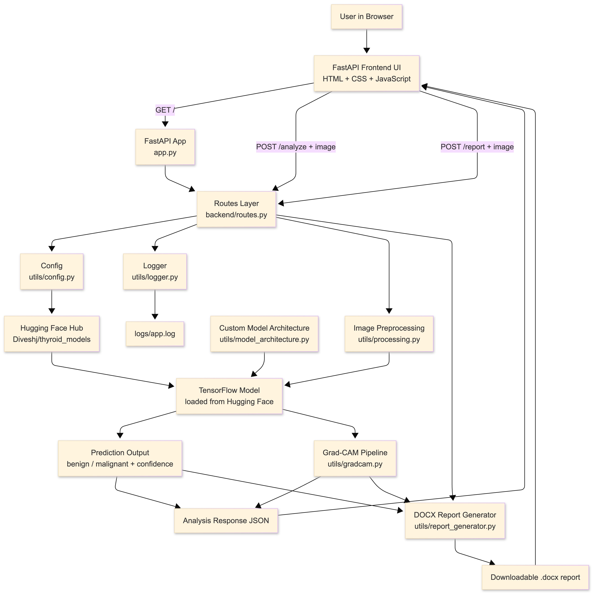
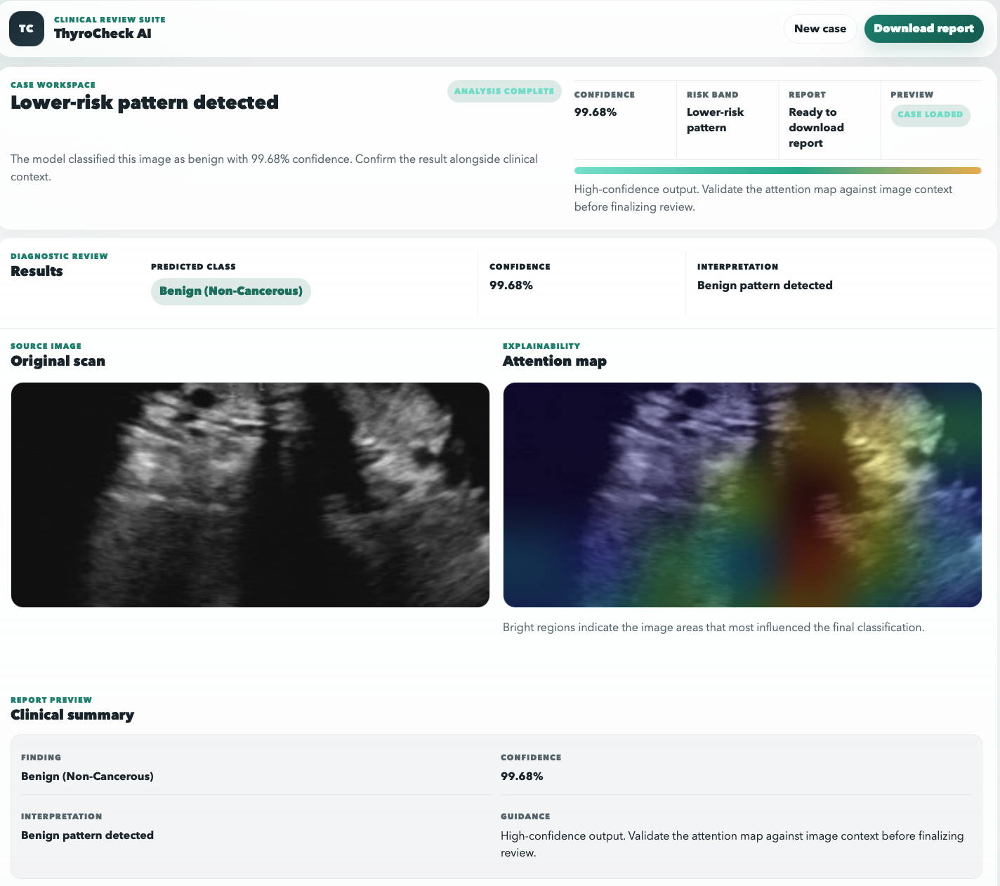

# ThyroCheck AI

Clinical review workspace for thyroid ultrasound image assessment, Grad-CAM explainability, and DOCX report export.

## What It Does

ThyroCheck AI accepts a single thyroid ultrasound still image, runs model inference, generates a Grad-CAM attention map when available, and produces a structured report that can be downloaded as a `.docx` file.

The current product surface is a FastAPI application with a custom HTML/CSS/JavaScript frontend.

## Current Workflow

1. Upload one PNG or JPEG ultrasound image.
2. Run inference automatically after selection.
3. Review the predicted class, confidence, original image, and attention map.
4. Export the case as a DOCX report.

## Highlights

- FastAPI-based web app served at `/`
- Custom clinical review UI in `frontend/`
- TensorFlow model loading from Hugging Face Hub
- Grad-CAM explainability for visual review support
- DOCX report generation with prediction context and image outputs

## Architecture Diagram

<p align="center">
  
</p>

## Result Preview

<p align="center">
  
</p>

## Project Layout

```text
thyroid-nodule-detection/
|-- app.py
|-- README.md
|-- requirements.txt
|-- backend/
|   `-- routes.py
|-- frontend/
|   |-- static/
|   |   |-- app.js
|   |   `-- style.css
|   `-- templates/
|       `-- index.html
|-- utils/
|   |-- config.py
|   |-- gradcam.py
|   |-- logger.py
|   |-- model_architecture.py
|   |-- processing.py
|   `-- report_generator.py
|-- model artifacts/
|-- test files/
|-- experiments/
|-- RESEARCH/
|-- NOTES/
`-- logs/
```

## Tech Stack

- FastAPI
- Uvicorn
- TensorFlow
- Hugging Face Hub
- NumPy
- Pillow
- OpenCV
- Matplotlib
- python-docx
- Jinja2

## Requirements

- Python 3
- `pip`

Install project dependencies with:

```bash
pip install -r requirements.txt
```

## Getting Started

### Option 1: Use the existing local environment

If you already have the repo-specific environment:

```bash
source mac_env/bin/activate
python app.py
```

### Option 2: Create a fresh virtual environment

```bash
python -m venv .venv
source .venv/bin/activate
pip install -r requirements.txt
python app.py
```

Then open:

```text
http://127.0.0.1:8000
```

## First Run Notes

- The model is loaded from Hugging Face on startup.
- First launch can take longer because the model may need to download and TensorFlow/Matplotlib may build local caches.
- If the Hugging Face repository requires authentication, authenticate before launch.

## Configuration

Model source is configured in [`utils/config.py`](utils/config.py):

- `REPO_ID = "Diveshj/thyroid_models"`
- `MODEL_FILENAME = "thyroid_cancer_model.keras"`

## API Surface

### `GET /`

Serves the main review interface.

### `POST /analyze`

Accepts an uploaded image and returns:

- prediction label
- raw score
- confidence percentage
- malignancy flag
- original image as base64
- Grad-CAM image as base64 when available

### `POST /report`

Accepts an uploaded image, reruns inference, and returns a downloadable DOCX report.

## Frontend Notes

The UI is built from:

- [`frontend/templates/index.html`](frontend/templates/index.html)
- [`frontend/static/style.css`](frontend/static/style.css)
- [`frontend/static/app.js`](frontend/static/app.js)

The frontend is designed around a progressive workflow:

- intake first
- preview after upload
- results after analysis
- report export after review

## Logs and Artifacts

- Runtime logs are written to `logs/app.log`
- Sample files for testing live in `test files/`
- Research and notes remain in `RESEARCH/` and `NOTES/`

## Operational Notes

- This project currently focuses on single-image review, not batch processing.
- Supported upload formats in the app are PNG and JPEG images.
- Grad-CAM may not be available for every run if heatmap generation fails, but inference and report generation can still complete.

## Quick Troubleshooting

### The server looks "stuck"

That usually means the FastAPI server is running and holding the terminal open. Open `http://127.0.0.1:8000` in a browser.

### The first run is slow

This is expected if the model is downloading or local font/model caches are being created.

### The report button does nothing

Run an analysis first. Report export is only available after a completed case review.
